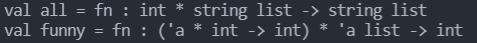
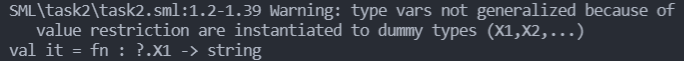

## 实验二

### 1

分析以下函数或表达式的类型（分析 + 程序验证）：

```sml
fun all(your, base) =
        case your of
            0 => base
          | _ => "are belong to us"::all(your - 1, base)

fun funny(f, []) = 0
    | funny(f, x::xs) = f(x, funny(f, xs))

(fn x => (fn y => x)) "Hello, World!"
```

-   答案

1. 函数 `all` 类型为 `int * string list -> string list`，其中参数 `your` 为 `int` 类型，`base` 为 `string list` 类型。
2. 函数 `funny` 类型为 `(typ * int -> int) * typ list -> int`，其中 `f` 函数的类型为 `fn: typ * int -> int`，`x` 的类型为 `typ`，`xs` 的类型为 `typ list`。
3. 表达式类型为：`fn: typ -> string`。

-   截图

</img>
</img>

### 2

用归纳法证明 `ins` 函数和 `isort` 函数的正确性

```sml
(*对任一整数 x 和有序整数序列 L，函数 ins(x, L) 计算结果为 x 和 L 中所有元素构成的一个有序序列。*)
fun ins(x, []) = [x]
    | ins(x, y::L) = case compare(x, y) of
            GREATER => y::ins(x, L)
                | _ => x::y::L
```

`isort : int list -> int list`

```sml
(*REQUIRES true*)
(*ENSURES isort(L) = a sorted perm of L*)
(*对所有整数序列 L，isort L 计算得到 L 中所有元素的一个有序排列。*)
fun isort [] = []
    | isort(x::L) = ins(x, isort L)
```

-   答案

    -   `ins` 归纳证明过程
        1. `L` 的长度为 0 时，返回 `[x]`，显然为有序表；
        2. 假设对所有长度小于 k ( k >= 1 ) 的有序表，`ins(x, A)` 为 `x::A` 的有序表，下证 `ins(x, L)` 为 `x::L` 的有序表，其中 `L` 的长度为 `k` 且为有序表。<br/>
           取 `L` 的 `hd` `y`，比较 `x` 和 `y` 的大小。若 `x > y`，说明在排序好的表中 `y` 应该在 `x` 的前面，此时由**归纳假设** `ins(x::L)` 是 `x::L` 的有序表，只需返回 `y::ins(x::L)` ，即得长度为 k 的有序表；若 `x <= y`，由于 `L` 已经有序，只需返回 `x::y::L` 即得长度为 k 的有序表。
        3. 综合 1、2，`ins` 函数正确。
    -   `isort` 归纳证明过程
        1. `L` 的长度为 0 时，返回 `[]`，显然为有序表；
        2. 假设对所有长度小于 k ( k >= 1 ) 的有序表，`isort L` 为 `L` 的有序表，下证 `isort(x::L)` 为 `x::L` 的有序表。<br/>
           由归纳假设 `isort L` 已经有序，又 `ins(x, L)` 为 `x::L` 的有序表，得证。
        3. 综合 1、2，`isort` 函数正确。

### 3

分析下面斐波那契函数的执行性能

```sml
fun fib n = if n <= 2 then 1 else fib(n - 1) + fib(n - 2);

fun fibber(0: int) : int * int = (1, 1)
    | fibber(n: int) : int * int =
        let val(x: int, y: int) = fibber(n - 1)
        in (y, x + y)
        end
```

借助：对所有非负整数 k，有

$$
fib(2k) = fib(k)(2fib(k + 1) - fib(k))\\
fib(2k + 1) = fib(k + 1)^2 + fib(k)^2
$$

-   答案

    -   在 `fib` 函数中，每次递归调用需要展开两个函数，时间复杂度为 $O(2^n)$；
    -   在 `fibber` 函数中，输入的值为 n，则需要迭代 n 次得到结果，时间复杂度为 $O(n)$。

### 4

定义函数 `divisibleByThree: int -> bool`，以使当 n 为 3 的倍数时，`divisibleByThree n` 为 `true`，否则为 `false`。注意：程序中不能使用取余函数 `mod`。

```sml
(*divisibleByThree: int -> bool*)
(*REQUIRES: n >= 0*)
(*ENSURES: divisibleByThree n evaluates to true if n is a multiple of 3 and to false otherwise*)
```

-   代码

```sml
(*divisibleByThree: int -> bool*)
(*REQUIRES: n >= 0*)
(*ENSURES: divisibleByThree n evaluates to true if n is a multiple of 3 and to false otherwise*)
fun divisibleByThree(0: int): bool = true
    | divisibleByThree 1 = false
    | divisibleByThree 2 = false
    | divisibleByThree n = divisibleByThree(n - 3);

(*测试*)
divisibleByThree(0);    //true
divisibleByThree(2);    //false
divisibleByThree(14);   //false
divisibleByThree(3);    //true
divisibleByThree(9);    //true
```

### 5

函数 `evenP` 为偶数判断函数，即当且仅当该数为偶数时返回 true。

其代码描述如下：

```sml
(*evenP: int -> bool*)
(*REQUIRES: n >= 0*)
(*ENSURES: evenP n evaluates to true if n is even.*)
fun evenP(0: int): bool = true
    | evenP 1 = false
    | evenP n = evenP(n - 2)
```

试编写奇数判断函数 `oddP: int -> bool`，当且仅当该数为奇数时返回 true。注意：代码不要调用函数 `evenP` 或 `mod`。

-   代码

```sml
(*oddP: int -> bool*)
(*REQUIRES: n >= 0*)
(*ENSURES: oddP n evaluates to true if n is odd.*)
fun oddP(0: int): bool = false
    | oddP 1 = true
    | oddP n = oddP(n - 2);

(*测试*)
oddP(0);    //false
oddP(1);    //true
oddP(14);   //false
oddP(7);    //true
```

### 6

编写函数 `interleave: int list * int list -> list`，该函数能实现两个 `int list` 数据的合并，且两个 `list` 中的元素在结果中交替出现，直至其中一个 `int list` 数据结束，而另一个 `int list` 数据中的剩余元素则直接附加至结果数据的尾部。如：

```sml
interleave([2], [4]) = [2, 4]
interleave([2, 3], [4, 5]) = [2, 4, 3, 5]
interleave([2, 3], [4, 5, 6, 7, 8, 9]) = [2, 4, 3, 5, 6, 7, 8, 9]
interleave([2, 3], []) = [2, 3]
```

-   代码

```sml
(*helper: int list * int list * list -> int list*)
(*REQUIRES: *)
(*ENSURES: function used for interleave*)
fun helper(A, [], L) = L @ A
    | helper([], B, L) = L @ B
    | helper(x::A, y::B, L) = helper(A, B, L @ [x, y]);

(*interleave: int list * int list -> list*)
(*REQUIRES: *)
(*ENSURES: *)
fun interleave(A: int list, B: int list) = helper(A, B, [])

(*测试*)
val L1 = [1, 2, 3, 4, 5, 6];
val L2 = [0, 0, 0];
val res = interleave(L1, L2);
```

-   修改

```sml
(*interleave: int list * int list -> list*)
(*REQUIRES: int list, int list*)
(*ENSURES: 交错排列两个 list 中的元素，最后多余的元素直接连在后面。*)
fun interleave([], B) = B
    | interleave(A, []) = A
    | interleave(x::A, y::B) = [x, y] @ interleave(A, B);

(*测试*)
val L1 = [1, 2, 3, 4, 5, 6];
val L2 = [0, 0, 0];
val res = interleave(L1, L2);
```

### 7

编写函数 `reverse` 和 `reverse'`，要求：

1. 函数类型均为：`int list -> int list`，功能均为实现输出表参数的逆序输出；
2. 函数 `reverse` 不能借助任何帮助函数；函数 `reverse'` 可以借助帮助函数，时间复杂度为 $O(n)$。

-   代码

```sml
(*
reverse: int list -> int list
REQUIRES: int list
ENSURES: reverse L evaluates the reverse of input list L.
*)
fun reverse [] = []
    | reverse [x] = [x]
    | reverse (x::L) = reverse L @ [x];

(*
helper2: int list * int list -> int list
REQUIRES: int list, int list
ENSURES: function used to help reverse'.
*)
fun helper2([], B) = B
    | helper2(x::A, B) = helper2(A, x::B);

(*
reverse': int list -> int list
REQUIRES: int list
ENSURES: reverse' L evaluates the reverse of input list L.
*)
fun reverse' []  = []
    | reverse' L = helper2(L, []);

(*测试*)
val l1 = [1, 2, 3, 4, 5, 6];
val l2 = [5, 4, 3, 2, 1];
val l1_rev = reverse(l1);
val l2_rev = reverse'(l2);
```

### 8

给定一个数组 `A[1...n]`，前缀和数组 `PrefixSum[1...n]` 定义为：`PrefixSum[i] = A[0] + A[1] + ... + A[i - 1]`；<br/>
例如：<br/>
`PrefixSum[] = []`<br/>
`PrefixSum[5, 4, 2] = [5, 9, 11]`<br/>
`PrefixSum[5, 6, 7, 8] = [5, 11, 18, 26]`<br/>
试编写：

1. 函数 `PrefixSum: int list -> int list`
   要求：$W_{PrefixSum}(n) = O(n^2)$。（n 为输入 `int list` 的长度）
2. 函数 `fastPrefixSum: int list -> int list`
   要求：$W_{fastPrefixSum}(n) = O(n)$。（提示：可借助帮助函数 `PrefixSumHelp`）

-   代码

```sml
(*
PrefixSumHelp: int list * int -> int list
REQUIRES: int list, int
ENSURE: PrefixSumHelp evaluates to add each num in list with k.
*)
fun PrefixSumHelp ([], k) = []
    | PrefixSumHelp(x::L, k) = (x + k)::PrefixSumHelp(L, k);

(*
PrefixSum: int list -> int list
REQUIRES: int list
ENSURE: PrefixSum evaluates preSum list of input list.
*)
fun PrefixSum [] = []
    | PrefixSum (x::L) = x::PrefixSumHelp(PrefixSum(L), x);

(*
fastPrefixSumHelp: int list * int -> int list
REQUIRES: int list, int
ENSURE:function used to help fastPrefixSum.
*)
fun fastPrefixSumHelp ([], k) = []
    | fastPrefixSumHelp (x::L, k) = (x + k)::fastPrefixSumHelp(L, x + k);

(*
fastPrefixSum: int list -> int list
REQUIRES: int list
ENSURE: fastPrefixSum evaluates preSum list of input list.
*)
fun fastPrefixSum [] = []
    | fastPrefixSum L = fastPrefixSumHelp(L, 0);

(*测试*)
val l1 = [1, 2, 3, 4, 5];
PrefixSum(l1);
fastPrefixSum(l1);
```
